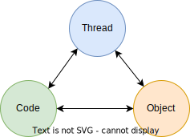

# Thread
### Tổng quan 
- Nhận thức về thread tạo ra một bức tranh rõ ràng về cách một chương trình hoạt động.
- Thread, code và object có mối quan hệ chặt chẽ với nhau.  
  

### Mối quan hệ giữa thread - code - object
Cụ thể:

#### Object và code  
- **Object** là một thể hiện (instance) của một class
- **Class** là một bản thế kế.  
Trong OOP, class đóng gói của một loại thực thể trong thực tế vào chương trình gồm những:
  - **data**/properties/đặc trưng 
  - **behavior**/method/algorithm và logic .    
  -> Giúp tổ chức các thành phần trong chương trình,   
    ví dụ chương trình quản lý xe trong cửa hàng được tổ chức thành class Car, Bill...
 
- Object phản ánh một _thực thế cụ thể_ từ class, đóng gói 1 instance trong một _ngữ nghĩa cụ thể_.  
Được truy xuất thông qua biến, với biến là nơi lưu trữ tham chiếu đến địa chỉ của object được lưu trong vùng nhớ heap.  
VD: Car redCar = new Car("red", "2015");  
- **Code** là một tập hợp lệnh hiện thực: 
  - Behavior của object (của class) 
  - Tương tác giữa các object

##### Kết luận:
- Object chứa code
- Code chứa kịch bản/ logic hiện thực behavior của object

#### Code và thread
- **Thread** là **đơn vị thực thi** nhỏ nhất trong một bộ xử lý (process), mỗi chương trình (program) chạy trên một process độc lập.
- Code được viết bằng ngôn ngữ lập trình (vd: java, c+, python...)   
    * Chứa tập lệnh thực thi một nhiệm vụ (function) bằng logic và algorithm:
      * Cái con người hiểu được
      * Cái máy tính có thể thực thi   
- Ngoài ra, tập lệnh trong code có thể định nghĩa cách quản lý và hành vi của thread: create, delete, stop, start, tương tác.

##### Kết luận:

- Code đóng vai trò trung gian cho giao tiếp giữa người và bộ xử lý máy tính, phản ảnh ở mức cao tập lệnh hay kịch bản con người muốn máy làm:  
  - Code chạy trên thread
  - Thread chạy code để thực thi một nhiệm vụ cụ thể

#### Thread và object
- Nhưng thread muốn chạy thì code là không đủ vì muốn chạy code:
  - Không chỉ cần tập lệnh / kịch bản của code
  - Mà còn cần input/data/đối tượng chịu tác động/ đối tượng phản ánh thay đổi/ ngữ nghĩa để tương tác với máy

##### Kết luận:

  - Object chính là phần trung gian đó:  
    - Thread muốn chạy code thì cần truyền code vào thread nhưng code không đứng độc lập, 
    code cần ngữ nghĩa, code cần là hành vi của một object cụ thể, code cần input cho hành vi,
    cần nơi lưu trữ thay đổi, code cần nằm trong một object   
  -> _Thread thực thi code thông qua object_   
- Nếu đặt object trong multiple threads, thì object còn đóng vai trò lưu trữ dữ liệu cái được chia sử giữa các thread   
-> Object giúp threads chia sẻ tài nguyên   

### Tính ứng dụng
Vậy góc nhìn về thread-code-object mang lại cho ta lợi ích gì:  
- Hiểu hơn về cách hoạt động các thành phần trong chương trình thật sự thực hiện nào để dùng phù hợp: 
  - Thread là máy thực thi lệnh, 
  - Code định nghĩa tập lệnh, 
  - Object là ngữ nghĩa (semantic) phản ánh một đối tượng được trừu tượng hóa và đưa vào trong chương trình để xử lý, đóng gói một dữ liệu đặc trưng và mô phỏng hành vi của đối tượng 
- Khi hiểu được thread, code và object khác nhau như thế nào, bạn sẽ có thể cân nhắc khi nào thì nên quan tâm đến vấn đề đồng bộ trong **multiple threads**:
    - Nếu bạn đang work trên 1 thread với 1 code,  2 objects khác nhau thì không vấn đề gì
    - Nhưng nếu bạn dùng 2 threads với 1 code,  1 object thì nên cân nhắc trường hợp xử lý dead block hay tranh chấp tài nguyên, 
  vì các threads có khả năng chia sẻ tài nguyên thông qua objects trong bộ nhớ heap.

##### Xét trường hợp nhiều threads chạy, ta có khả năng thực hiện song song, đồng thời nhiều nhiệm vụ cùng lúc nhằm tăng hiệu suất chương trình

1. 2 threads chạy 2 objects khác nhau -> tương tác trên hai ngữ nghĩa khác nhau -> tạo kết quả độc lập cho từng object    
=> ta thấy code chạy đồng thời
2. 2 threads chạy song song nhưng 2 lần chạy cần tác động chung trên một object (ngữ nghĩa)  
Phải đảm bảo kết quả đúng, là luôn ra cùng một kết quả có thể đoán định cho mọi lần chạy (consistent)  
Ta cần đồng bộ (synchronization mechanism)   
Ví dụ, ta có list 10 học sinh cần lưu vào một object Cource, trước khi lưu cần chuyển đổi một vài data   
Ta tách list trên làm 2 nhóm cho 2 thread xử lý đồng thời, giảm thời gian thực thi của phần convert data này xuống một nửa  
Khi cập nhật vào list, nếu để thread chạy tự nhiên thì không biết được thứ tự sinh viên bị thay đổi như nào, mà ta muốn giữ thứ tự học sinh theo nhóm,  
Vậy ta khóa list (synchronize) trong Cource để list này được thực hiện lần lượt  

##### Dùng nhiều threads
- Giúp tăng tốc độ phản hồi của chương trình   
VD: một máy chỉ xử lý được một require của một user,   
Giờ có 2 threads, giống như có 2 máy, bạn có thể xử lý cho 2 users cùng lúc  
Giảm bớt thời gian chờ của user

- Có 2 trường hợp: 
  - 2 nhiệm vụ không liên quan gì đến nhau như 2 users khác nhau cập nhật 2 mật khẩu độc lập
  - Nhưng nếu 2 nhiệm vụ liên quan hay ta cần 2 threads tương tác với nhau thì cần phải làm sao:
    - Cùng cập nhật trên một shared object -> đảm bảo task 1 xong là complete thì task 2 mới chạy trên the shared object hoặc ngược lại  
Đảm bảo tính toàn vẹn của một nhiệm vụ không bị thay đổi
    - Phải đảm bảo kết quả mỗi lần đến như nhau
    - Ví dụ: cập nhật tài khoản người chuyển và người nhận phải cùng được cập nhật thành công ở 2 object tài khoản khác nhau.  
  Ta dùng synchronize cho 2 objects -> nhưng sẽ tốn thời gian và tài nguyên chỗ này.


### Ứng dụng trong swing:

#### Đặt vấn đề:

- Với những phần tương tác với giao diện ta phải đảm bảo tính phản hồi trên giao diện mượt mà.
- Swing GUI cần chạy trên 1 UI thread duy nhất (Event dispatch thread - EDT) vì cần:
  - Thay đổi được cập nhật trên nhiều giao diện đồng nhất
  - Luôn đảm bảo kết quả đoán định được, đúng mọi lúc
  - Nếu dùng multiple threads thì sẽ rất phức tạp trong xử lý đồng bộ 
  - Event dispatch thread là thread quản lý sự kiện và cập nhật component hiển thị nên thường chỉ có những xử lý đơn giản và nhanh chóng
- Vậy làm sao mà chạy mượt nếu chỉ có 1 thread mà không bị đứng (hang: không phản hổi, chờ) cho những xử lý khác nếu không chỉ là xử lý giao diện.

- Swing cho chúng ta:
  - SwingWorker: tách những nhiệm vụ chạy tốn thời gian mà không cần dùng UI ra một luồng khác thực thi
  - SwingUtilities.invokeLater: cho phép ta tương tác với UI thread từ thread khác

##### SwingWorker:

1. Mục đích: Để tránh tình huống UI bị treo, không phản hồi những task tốn thời gian được thực thi trên thread khác, 
để thread UI được chạy liên tục với những nhiệm vụ đơn giản một cách nhanh chóng

2. Giải thích cách thức  
Ứng dụng multiple threads vào bài toán swing chỉ có 1 UI thread:  
- Không phải UI task nào cũng phức tạp và chạy lâu, vì những thao tác xử lý event của UI component thường đơn giản và 
có thể thực hiện nhanh chóng.   
 Ví dụ: bạn click vào một button thì bảng bên cạnh nó sẽ được ẩn đi 
- Với những task mà không chỉ tương tác với UI, ta còn cần cập nhật database, call service ...  
 Thì thời gian sẽ lâu hơn rất nhiều vì ta phải đợi phản hồi từ máy khác hay quá trình xử lý phức tập 
rồi mới xử lý phần UI phản hồi lại user sau đó chẳng hạn.
  - Phần lâu đó có thể đến từ mạng không ổn định khi call service, logic xử lý phức tạp, 
quá trình lưu data lâu khi database thuộc một lab khác, hay 
nếu bạn đang dùng hệ quản trị cơ sở dữ liệu quan hệ (RDBMS) thì có thể còn phụ thuộc vào các mức độ isolation mà bạn đang dùng, vv...
  - Với loại task thứ 2 này mình có thể chia nhỏ task thành nhiều phần hơn:
    - Task UI thì nhanh
    - Task xử lý thì tốn thời gian, ta để nó chạy ngầm trên một luồng khác
      - Nhưng sau khi chia, ta lại có những nhu cầu khác với background task này:
      - 1, Không cần quan tâm đến kết quả trả về 
      - 2, Cần nhận kết quả trả về sau cùng
      - 3, Cần nhận trạng thái cập nhật từng giai đoạn

=> Đáp ứng những nhu cầu trên, swing support SwingWorker.  
- SwingWorker: cung cấp một luồng mới ngoài UI thread cho task xử lý lâu
- Nếu bạn không quan tâm đến kết quả trả về -> bạn chỉ cần implement doInBackground()
- Nếu bạn muốn nhận kết quả sau cùng để cập nhật UI -> bạn chỉ cần implement done() 
- Nếu bạn muốn nhận trạng thái trong từng giai đoạn để cập nhật UI process -> bạn chỉ cần implement process() 

3. Cách dùng
- Bạn cần định nghĩa kiểu trả về cho method done và process khi new object implement SwingWorker
- Muốn lấy kết quả sau cùng của doInBackground trong done, bạn gọi get()
- Muốn lấy kết quả trạng thái của doInBackground trong process, bạn call publish và truyền vào trạng thái thông báo, 
  bạn lấy được danh sách data đã publish trong argument của process() 
- Vì SwingWorker là một thread nên chỉ được thực thi sau khi start, ở đây chính là call execute() method để bạn start 
background worker thread.  

4. Ví dụ

```java
import javax.swing.*;
import java.awt.*;
import java.awt.event.ActionEvent;
import java.awt.event.ActionListener;
import java.util.List;

public class SwingWorkerExample {

    public static void main(String[] args) {
        JFrame frame = new JFrame("SwingWorker Example");
        JButton button = new JButton("Fetch Data");
        JProgressBar progressBar = new JProgressBar(0, 10);
        progressBar.setStringPainted(true);

        button.addActionListener(new ActionListener() {
            @Override
            public void actionPerformed(ActionEvent e) {
                // When the button is clicked, start a background worker task
                // specifying the types for the result and intermediate results if needed
                new SwingWorker<String, Integer>() {
                    @Override
                    protected String doInBackground() throws Exception {
                    // This code runs in the background thread
                    // a time-consuming task (e.g fetching data from a server)
                        for (int i = 1; i <= 10; i++) {
                            // Simulate a time-consuming task
                            Thread.sleep(500);
                            // Publish interim results
                            publish(i);
                        }
                        return "Data fetched successfully!";
                    }
                    @Override
                    protected void process(List<Integer> chunks) {
                        // This code runs on the EDT
                        // can process interim results
                        for (Integer progress : chunks) {
                            progressBar.setValue(progress);  // Update UI with interim result
                        }
                    }

                    @Override
                    protected void done() {
                        try {
                            //This code runs on the EDT
                            // Update UI with the result when the background task is done
                            // Get the final result
                            JOptionPane.showMessageDialog(frame, get());
                        } catch (Exception ex) {
                            ex.printStackTrace();
                        }
                    }
                    //starts the background task
                }.execute();
            }
        });

        frame.setLayout(new FlowLayout());
        frame.getContentPane().add(button);
        frame.getContentPane().add(progressBar);
        frame.setSize(300, 200);
        frame.setDefaultCloseOperation(JFrame.EXIT_ON_CLOSE);
        frame.setVisible(true);
    }
}
```

Note:
Ta thấy rằng SwingWorker support 2 thread khác nhau, một cái là UI thread một cái là background worker thread.  
Vậy làm sao 2 thread này giao tiếp với nhau?
- Chính là nhờ SwingUtilities.invokeLater được gọi trong done() và process()  

##### SwingUtilities.invokeLater:

1. Mục đích:  
- Giúp bạn dù đứng ở thread nào cũng sẽ đều thực thi được code trên UI thread.
- Đảm bảo code bạn sử dụng với Swing component luôn được chạy trên UI thread (EDT).

2. Giải thích cách thức  
- Vì trong API của method trên, nhận vào 1 object implement Runnable, cái mà sẽ được add vào Event queue của UI thread nên
  code trên object này sẽ có thể được chạy trên UI thread


3. Cách dùng  
- Thường dùng khi bạn xử lý xong một task tốn thời gian ở thread chạy ngầm khác _ cái không phải UI thread 
và bạn muốn cập nhật Swing component trên UI thread.
- Bạn call SwingUtilities.invokeLater, bỏ vào method này một object của class implement Runnable, đưa code bạn muốn xử lý 
 vào hàm run().  

4. Ví dụ  

```java

import javax.swing.*;

public class InvokeLaterExample {

    public static void main(String[] args) {
        JFrame frame = new JFrame("InvokeLater Example");
        JButton button = new JButton("Update UI");

        button.addActionListener(e -> {
            // Perform a time-consuming task in a background thread
            new Thread(() -> {
                // Simulate a time-consuming task (e.g., complex computation)
                try {
                    Thread.sleep(2000);
                } catch (InterruptedException ex) {
                    ex.printStackTrace();
                }

                // Update UI on the EDT using invokeLater
                SwingUtilities.invokeLater(() -> {
                    JOptionPane.showMessageDialog(frame, "UI updated after background task.");
                });
            }).start();
        });

        frame.getContentPane().add(button);
        frame.setSize(300, 200);
        frame.setDefaultCloseOperation(JFrame.EXIT_ON_CLOSE);
        frame.setVisible(true);
    }
}
```

Cũng tương tự như SwingUtilities.invokeLater, SwingWorker một xử lý trên swing có thể được xử lý trên actionListener,
vậy những khái niệm này có gì giống và khác nhau trong swing:  

|           | SwingWorker                                                                                                                                                                                                                                                                                                                                                                                                                       | SwingUtilities.invokeLater                                         | ActionListener                           |  
|-----------|:----------------------------------------------------------------------------------------------------------------------------------------------------------------------------------------------------------------------------------------------------------------------------------------------------------------------------------------------------------------------------------------------------------------------------------|:-------------------------------------------------------------------|:-----------------------------------------|
| Type      | Abstract class                                                                                                                                                                                                                                                                                                                                                                                                                    | Interface                                                          | Interface                                |
| Chức năng | Chạy ngầm 1 task phức tap / mất nhiều thời gian trên 1 thread khác <br/>, xử lý phản hồi trả về cho UI thread                                                                                                                                                                                                                                                                                                                     | Cho phép một thread ngoài UI thead có thể chạy được trên UI thread | Xử lý event của component trên UI thread |
| Sử dụng   | - Anonymous inner class: Nếu chỉ dùng một lần, và cần truy cập member variables của GUI class mà không cần export ra ngoài<br/> - Inner class: trong 1 class mình muốn reuse cho nhiều method khác trong cùng class dùng và muốn truy cập member variables của GUI class mà không cần export </br> - A new class: can reuse for many classes, nhưng bạn phải export member variables của GUI classes bạn muốn dùng                | Like SwingWorker                                                   | Like SwingWorker                         |
| 


  
